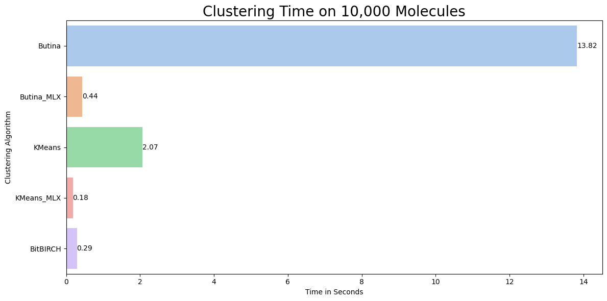

[](https://pypi.org/project/mlx-mol-cluster/)
[](https://github.com/ml-explore/mlx)

# MLXMolCluster

Leverage Apple Silicon to cluster molecules using MLX. 

At the time of writing, the project contains two clustering methods:
- Butina
- KMeans

Additional clustering methods will be added over time.

Examples have been written and can be found [here](tutorial). 

## Installation
Install from PyPI:
```python
pip install mlx-mol-cluster
```
Or install directly from the GitHub repository:
```python
pip install git+https://github.com/tlint101/MLXMolCluster.git
```

## Example
The following is an example of clustering molecules using Butina on MLX.
```python
# generate molecular fingerprints. Can be done on multiple CPUs
fp_gen = FPGenerator(smi_list)
rdkit_fps = fp_gen.fingerprint(type='rdkit', nbits=1024, n_cpu=10)

# convert to mlx arrays
mlx_fp = fp_to_mlx(rdkit_fps)

# Butina cluster
butina_mlx = butina(mlx_fp)
```

A speed comparison can be seen at the [tutorial section](tutorial). The runs were performed on a M2 Pro chip 
(10 CPU, 16 GPU)


**NOTE:** The figure can be misleading. The figure shows the clustering speed of already generated molecular 
fingerprints. The main bottleneck of clustering remains on the generation of molecular fingerprints. This is done on the 
CPU before being converted to the GPU. Depending on the number of molecules, this can be time intensive.

### Additional
Collaborations are welcome!